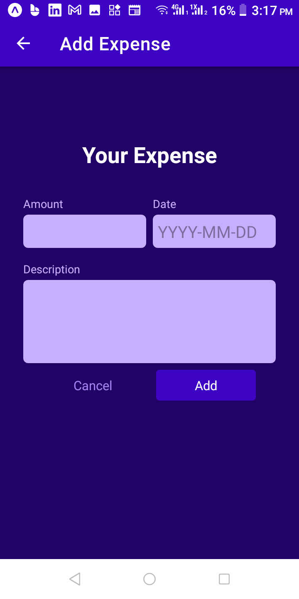
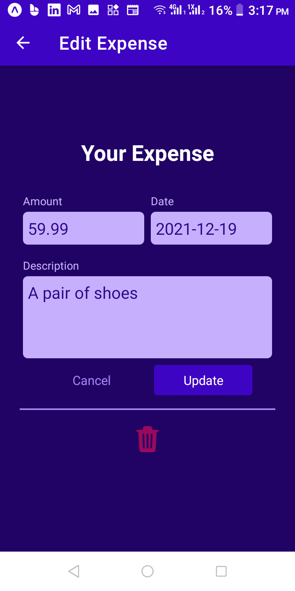
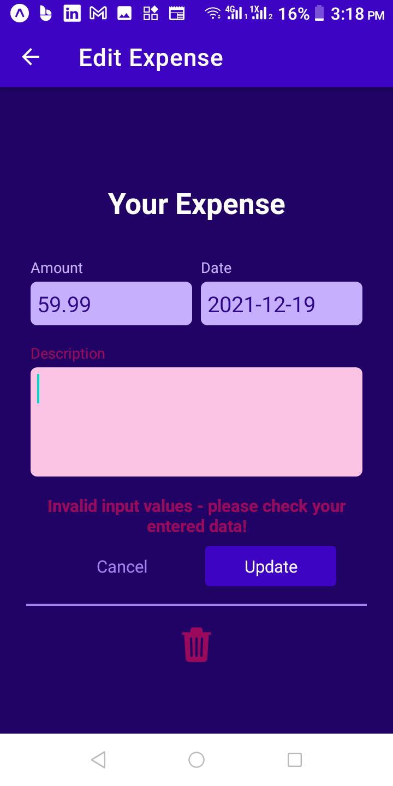

# Expense Tracker (using React-Native)

A sample expense tracker app built using react-native

## Screenshots

<div align="left">
    
    
    
    
    
</div>

## Environment Variables

```
REACT_APP_BACKEND_URL
```

## Installed Packages

```sh
yarn add @react-navigation/native

npx expo install react-native-screens react-native-safe-area-context

yarn add @react-navigation/native-stack

yarn add @react-navigation/bottom-tabs

yarn add axios

yarn add --dev react-native-dotenv
```
